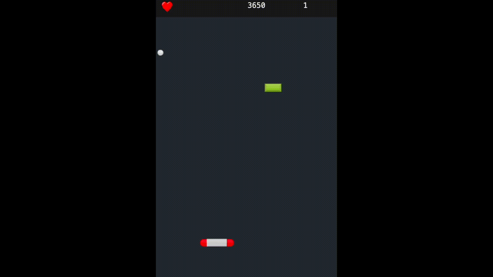
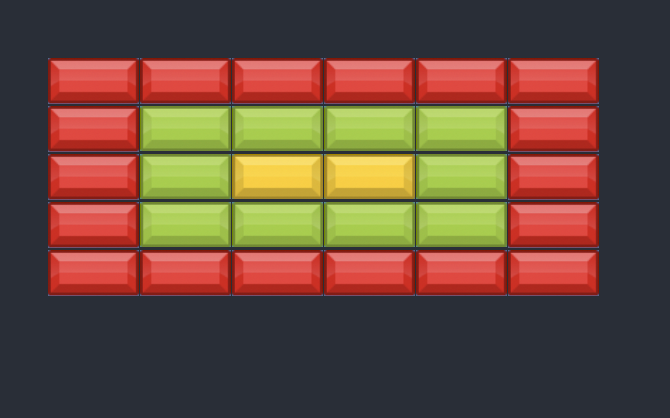
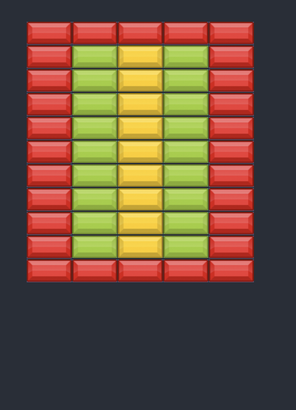
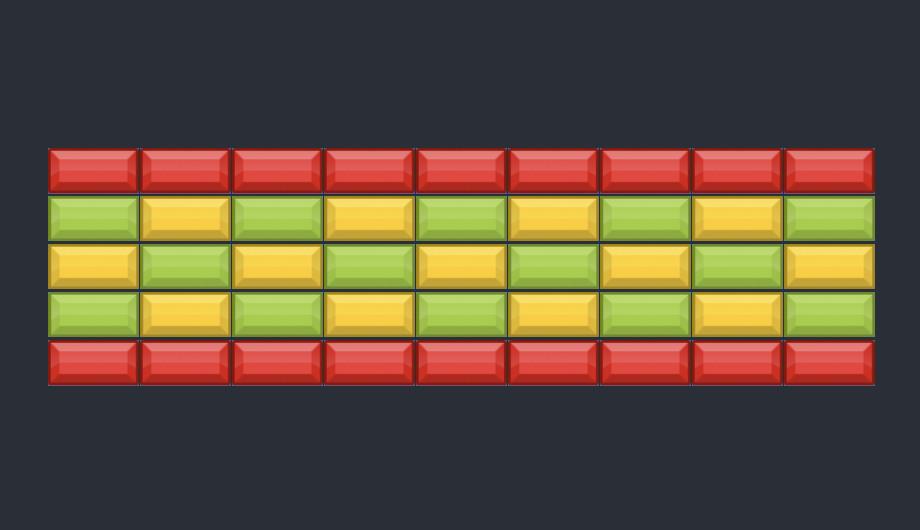
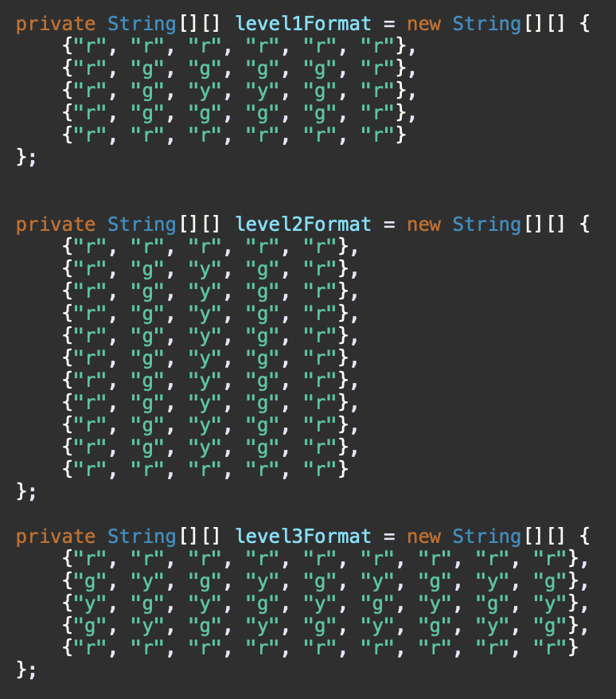
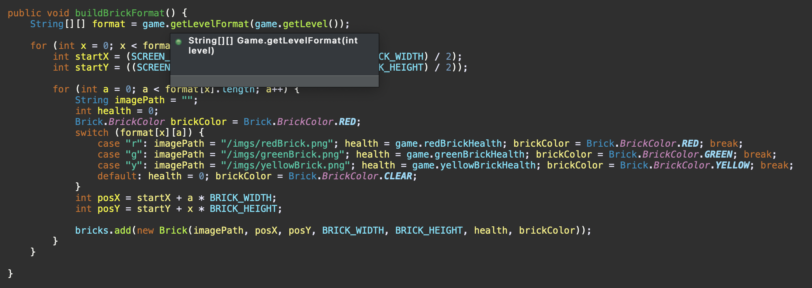
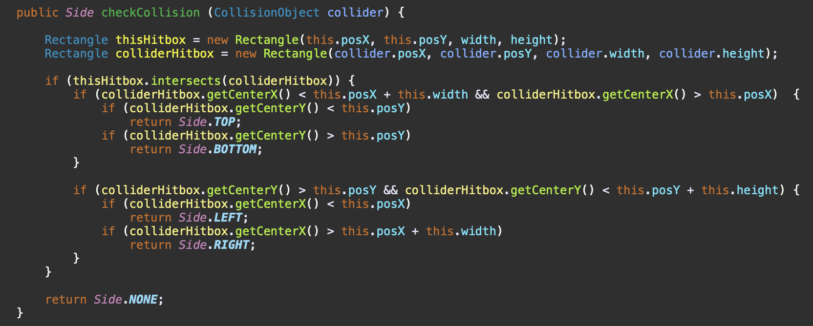

# Brick Breaker

This is a game based on the popular "breakout" game from the 1970s made for a school class. It 
uses object-oriented programming and inheritance, with most classes extending the `CollisionObject` class. This allowed me to reduce much of my main code (`Frame.java`) extensively so my code could be concise.

## Gameplay

(The gif is actually slightly too slow, and the game is usually faster)

The Paddle can move left and right, and the ball bounces around the frame. The aim of the game is to break all of
the bricks by blocking the ball's path by moving the paddle (with the left and right arrow keys) in order to collect points and move onto the next level while not losing three lives. 

Each brick color has a different health and point value.
- Red bricks have 1 health and are worth 100 points
- Green bricks have 2 health and are worth 150 points
- Yellow bricks have 3 health and are worth 250 points

If the ball ever passes under the paddle, you will lose a life (shown by the heart count in the top left corner of 
the game screen). If you drop to 0 lives, the game ends. 

Also, you can aim the ball slightly by moving your paddle in the direction that you want it to go (when they collide). This is
a particularly useful feature, and it makes the game actually fun to play (instead of highly irritating).

## Levels

The game includes three levels with a different arrangement of bricks. Level-ups happen automatically, as soon as you break the last brick and pass the ceiling.

#### Level one:

#### Level two:

#### Level three:

This is accomplished by defining the brick formats using 2D string arrays and parsing through them.

The parser:

## Collisions
Nearly all objects extend the `CollisionObject` class so that any colliding object, like the ball, can be passed to each brick easily. The collision detection is accomplished by relying on the `Rectangle` class and its `intersects()` method. Then, depending on the position of the argument object to the current object, the direction of the ball is switched.

This also allows all of the extending classes to be very simple, each with only a few methods and roughly 100 lines of code. 

